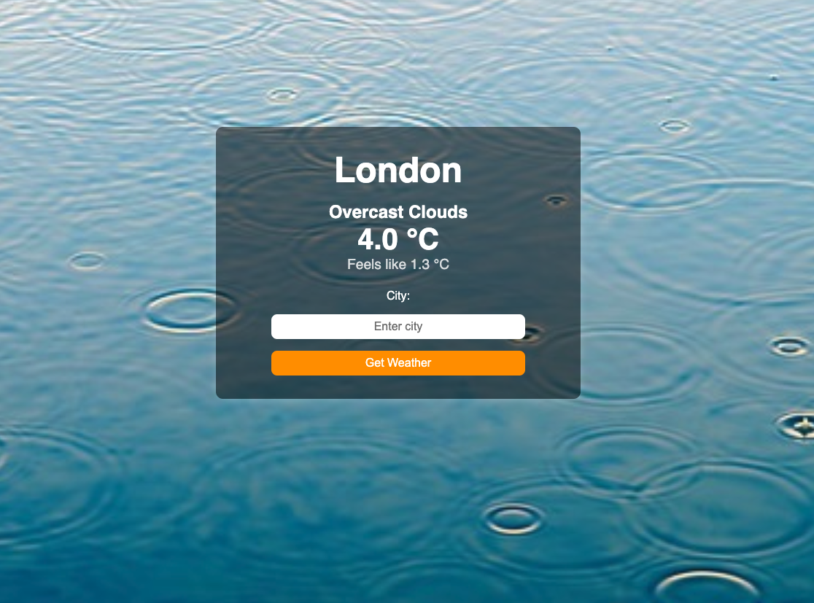

# 🌤️ Weather App

## 📖 Overview

The **Weather App** is a web application that allows users to check real-time weather conditions by entering a city name. It fetches weather data from the **OpenWeatherMap API** and displays relevant weather details such as temperature, weather condition, and feels-like temperature. The application is built using **Flask** for the backend and **HTML, CSS, and JavaScript** for the frontend.

## 🚀 Technologies Used

- **Backend**: Flask (Python)
- **Frontend**: HTML, CSS (Tailwind), JavaScript
- **API**: OpenWeatherMap API
- **Database**: None (Relies on real-time API calls)
- **Deployment**: Render (PaaS)
- **Web Server**: Gunicorn
- **Styling**: Tailwind CSS, Custom CSS
- **Error Handling**: Flask error messages with user-friendly UI

## 🎯 Features

- 🌍 **Search for any city** to get current weather conditions
- ⏳ **Real-time data** fetched from OpenWeatherMap API
- 🎨 **Responsive Design** that works on all devices
- ❌ **Error Handling** for invalid city names
- 🌄 **Background Image** dynamically displayed

## 📸 Screenshot



## 🛠️ How It Works

1. User enters a city name in the input field
2. The application sends a request to the OpenWeatherMap API
3. The API responds with real-time weather data
4. Flask processes the response and sends it to the frontend
5. Weather data is displayed dynamically in a structured format

## 🏗️ Installation & Setup

### 🔧 Prerequisites

Ensure you have **Python 3** installed and create a virtual environment.

### 📥 Clone the repository

```sh
git clone https://github.com/YOUR_GITHUB_USERNAME/weather-app.git
cd weather-app
```

### 📦 Install dependencies

```sh
pip install -r requirements.txt
```

### 🔑 Set up API key

1. Create a **.env** file in the root directory
2. Add your OpenWeatherMap API key:

```env
API_KEY=your_openweathermap_api_key
```

### 🚀 Run the application locally

```sh
python server.py
```

Open a web browser and navigate to:

```
http://127.0.0.1:8080
```

## 🌍 Live Demo

The Weather App is deployed on Render. You can access it here:

🔗 **[Live App](https://python-weather-app-ml3g.onrender.com/)**

## 🤝 Contributing

Feel free to fork this project and submit pull requests! 🚀

## 📜 License

This project is licensed under the **MIT License**.

